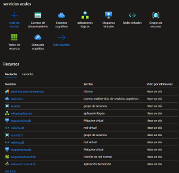
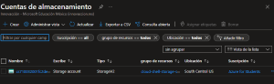
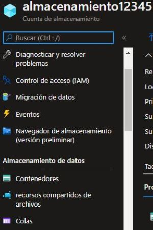
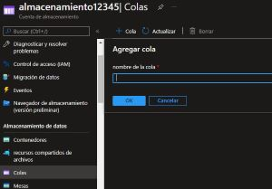
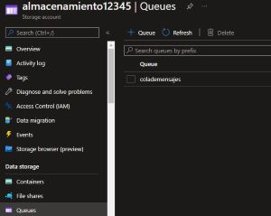
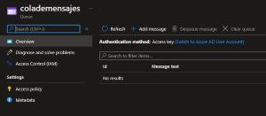
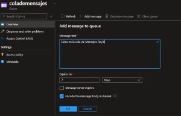

# DATOS Y ALMACEN

**Storage: Proporciona servicios de almacenamiento de archivos y objetos.**

### Cuenta de Almacenamiento de Azure

- **Modelo de servicio:** IaaS.
- **Caracteristicas:** Seguridad, alta, disponibilidad, durabilidad y escalabilidad.

La cuenta de almacenamiento de es la que contiene todos los objetos de los demas servicios.

-----------------------------------------------------------------------------------
## Azure Queue Storage  *(Queue= significa cola)*

Lo que hace es encolar mensajes.

Mensajes pequeños o textos pequeños.

El primer mensaje que llega, es el primero que sale.

- **Modelo de servicio:** IaaS
- **Funcion:** Para almacenar cantidades de mensajes.
- **Caracteristicas:** Accesibles por HTTP o HTTPS.
- **Caracteristicas:** Encola mensajes de hasta 64KB.
- **Cuando usar:** Respuestas de APIs, servicios de mensajeria, loT.

-----------------------------------------------------------------------------------------------------------------------------

### Pasos para crear un Azure Queue Storage

1.- Abrimos el [Portal Azure](portal.azure.com).

2.- Nos vamos a nuestro almacenamiento.

3.- Buscamos donde dice cola.

4.- Agregamos una cola de mensaje.

5.- Le damos un nombre a la cola de mensajes.

6.- Accedemos a la cola creada.

7.- agregamos un mensaje y ponemos en cuanto expira.

8.- Se cargara eso, los podemos ir quitando o agrenado otros mensajes.

9.- No se puede editar, solo borrar, resetear toda la cola o agregar.
